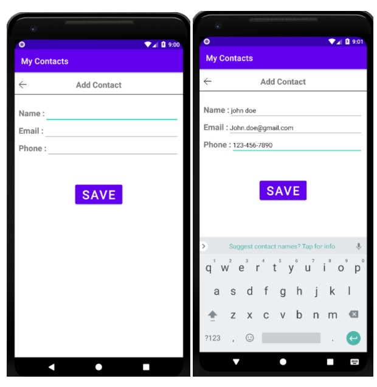

# kotlin-Contact-Management-App

**Description**: A contact management application. A user can create and update contacts using the app. The contacts are stored in a SQLite database.

**Project Demo**

A splash screen with the name of the application is displayed upon startup. If no contacts are stored the application will display “No contacts found. Please add a contact.” 

If there are existing contacts, they will be displayed using a RecyclerView.

To add a contact, the user must click on the floating action button (FAB). This will bring up the add contact page, where the user can enter the name, email address, and phone number of a contact and select “Save” to add it to the database. 

The contact will then be displayed on the main screen, and a success message is displayed. To update a contact, the user may select any contact on the main screen. This will bring up a screen with the selected contact’s information. The user can then edit the information and select “Update”, at which point the contact information will be updated in the database and a success message is displayed.

If a user leaves a field blank when creating or updating a contact, the application displays a message “Please fill all the fields”

The user can change the background color of the application using the overflow menu on the home screen. The color options are yellow, blue, and green.

